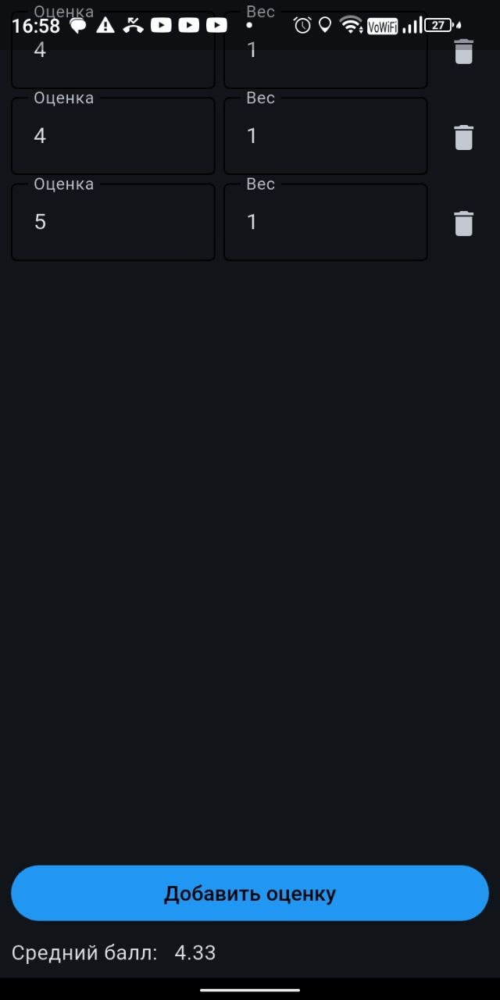
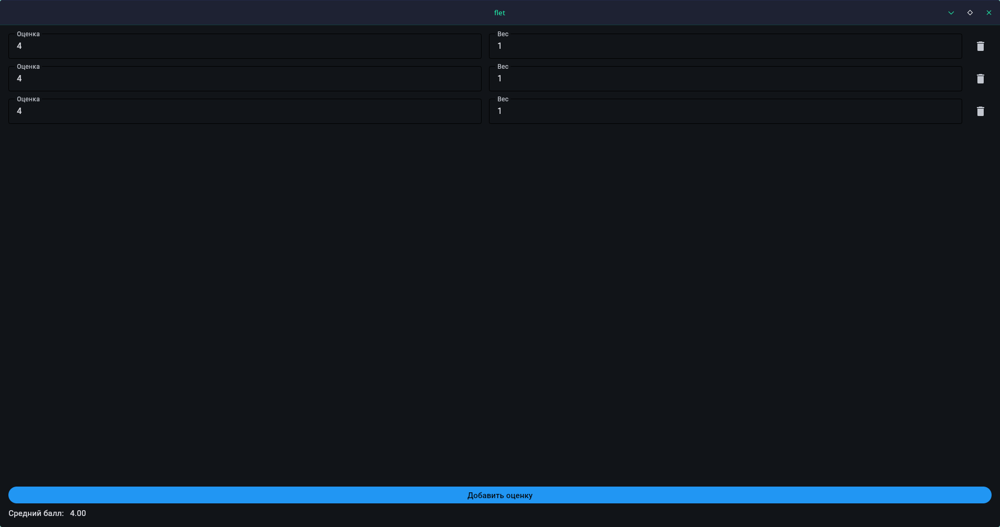

 # Калькулятор Среднего балла
[скачать](https://github.com/pro99d/avg-grades/releases/latest)

<!--  -->
<!--  -->

## Запустить приложение

### uv

Запустить как desktop-приложение:

```
uv run flet run
```

запустить как web-приложение:

```
uv run flet run --web --port <порт>
```

## Собрать приложение

### Android

```
flet build apk -v
```

### iOS (только на macOS)

```
flet build ipa -v
```

### Linux/Windows/macOS

```
uv run build.py
```

